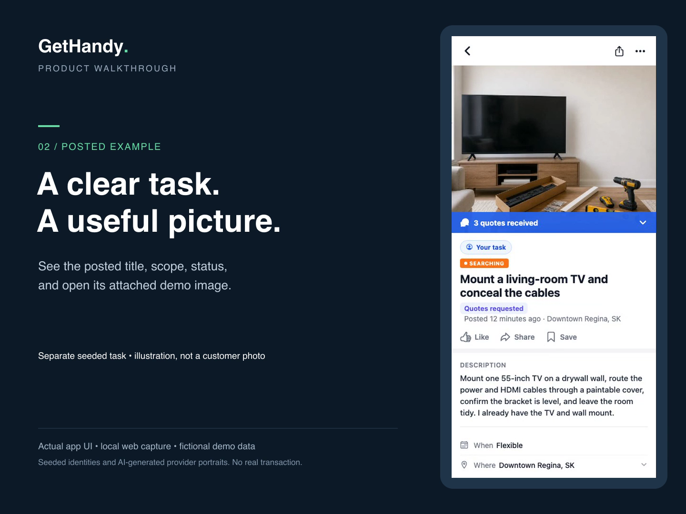

# Chet Paslawski

Product engineer in Saskatchewan, Canada. I've been building software products since 2022, across mobile, web and desktop.

## What I build

###  GetHandy

A local-services marketplace covering job posting, quotes, hiring, Stripe payments and completion. I built the product workflow and payment integrations, including duplicate-event handling and transfer reconciliation.

**React Native · TypeScript · Supabase · PostgreSQL · Stripe**

**[Watch the 54-second walkthrough](https://github.com/TrackerXXX23/TrackerXXX23/blob/main/assets/gethandy-demo.mp4)** · [Product and engineering details](gethandy.md)

*Recorded in the app with fictional demo data and Stripe test mode.*

###  ClipPipeline

A desktop video editor for gaming recordings. I built the editing and export workflow, with FFmpeg job progress, cancellation and a fallback when a hardware encoder fails.

**Electron · React · TypeScript · FFmpeg**

###  MyMeetings

AI meeting notes and client records. I integrated live transcription, structured summaries and follow-up actions, with recovery for interrupted transcripts.

**React Native · TypeScript · Supabase · WebSockets**

## How I work

I use Claude Code and Codex through implementation, review and testing. I build reusable skills, commands and handoff workflows, configure MCP connections, and turn recurring review findings into checks.

I set the scope, make the engineering decisions and verify the result.

[LinkedIn](https://www.linkedin.com/in/chetpaslawski) · [Email](mailto:chet@gethandy.app)
