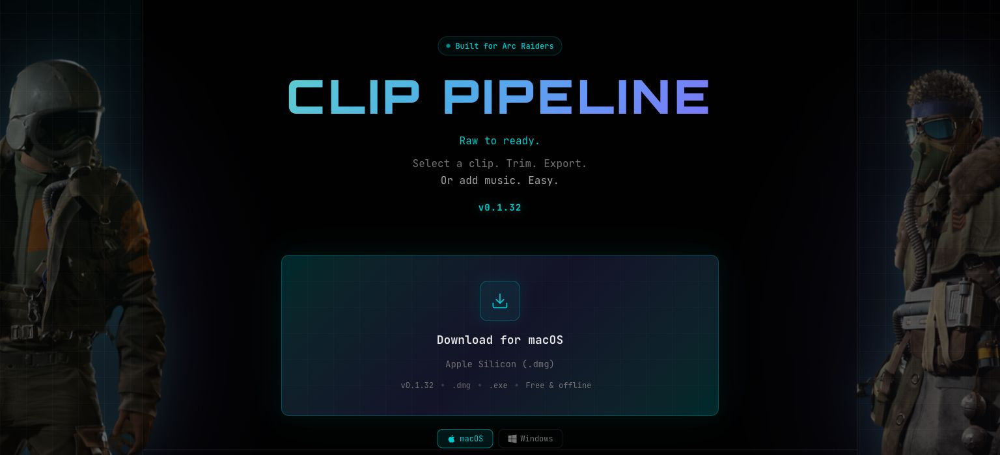

# Chet Paslawski

Product engineer building interactive 3D tools, cross-platform apps and real-time AI workflows. Based in Saskatchewan, Canada; building software products since 2022.

I take products from the customer workflow through implementation and testing, including the recovery paths when a payment, recording or export is interrupted.

## What I build

### CellForge

A play-first robotic workcell simulation. Choose a normal, moved-fixture or blocked scenario, then watch a UR20 pick stock, load the CNC, machine the part and unload it. Under the demo, full-path rehearsal, measured-motion gates and bounded layout recovery keep the engineering evidence honest.

**React · TypeScript · Three.js · React Three Fiber**

[Launch the live demo](https://cellforge-orcin.vercel.app) · [Open-source repository · MIT](https://github.com/TrackerXXX23/cellforge) · [Verification evidence](https://github.com/TrackerXXX23/cellforge/blob/main/docs/self-cell-collision-verification.md)

*Simulation prototype; no physical robot or PLC connection. Original code is MIT licensed; robot assets retain separate terms.*

© 2023 Universal Robots A/S. Use hereof is subject to Universal Robots A/S’ <a href="https://github.com/TrackerXXX23/cellforge/blob/main/public/robots/ur20/ur_description/meshes/ur20/LICENSE.txt">Terms and Conditions for Use of Graphical Documentation</a>.

###  GetHandy

A local-services marketplace covering job posting, quotes, hiring, Stripe payments and completion. I built the product workflow and payment integrations, including duplicate-event handling and transfer reconciliation.

**Expo (React Native) · TypeScript · Supabase · PostgreSQL · Stripe**

[Website](https://www.gethandy.app/)

https://github.com/user-attachments/assets/66dbddaf-0c7f-4914-8259-5dca5cbddb9b

**Watch the narrated demo · 54 seconds** · [How I handle payout retries](gethandy.md#engineering-case-study-a-payout-succeeds-then-the-worker-crashes)

*Recorded in the app with fictional demo data and Stripe test mode.*

Explore the GetHandy website

###  ClipPipeline

A desktop video editor for gaming recordings. I built the editing and export workflow, with FFmpeg job progress, cancellation and a fallback when a hardware encoder fails.

**Electron · React · TypeScript · FFmpeg**

[Website and downloads](https://clippipeline.vercel.app/) · [Project details](clippipeline.md)

Explore ClipPipeline · website and downloads

###  MyMeetings

AI meeting notes and client records. I integrated live transcription, structured summaries and follow-up actions, with recovery for interrupted transcripts.

**Expo (React Native) · TypeScript · Supabase · WebSockets**

[Open MyMeetings · sign-in required](https://app.mymeetings.ai/) · [Project details](mymeetings.md)

Open MyMeetings · sign-in required

## How I work

I define the workflow, make the engineering decisions and verify the result. I use Claude Code and Codex for implementation and review, and turn failure cases into regression checks.

For product engineering opportunities, [email me](mailto:chet@gethandy.app).

[LinkedIn](https://www.linkedin.com/in/chetpaslawski) · [Email](mailto:chet@gethandy.app)
