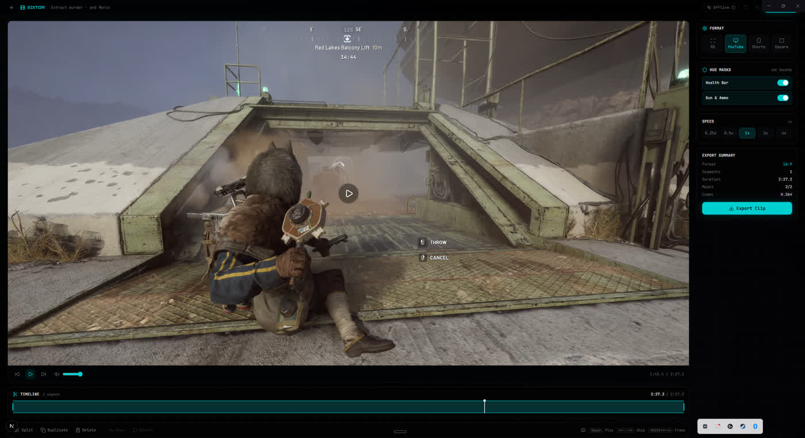

# ClipPipeline

[Website and downloads](https://clippipeline.vercel.app/)

## From a gaming recording to a finished clip

I wanted a better way to turn my gaming recordings into clips. I built a desktop editor to review footage, trim highlights, add captions and export from a timeline.

*The ClipPipeline editor showing a gaming recording, timeline and export controls.*

## My work

- Product design and the Electron/React editing interface.
- FFmpeg processing with progress reporting and cancellation.
- Media probing and a real-sample hardware-encoder check, with a fallback when an encoder is unusable.

## An engineering decision

Hardware and codec support vary between machines. An encoder appearing in a capabilities list does not prove it will handle a real job. I test it with a sample before selecting the processing path, and give long-running exports visible progress and a way to stop.

**Built with:** Electron, React, TypeScript and FFmpeg.

[Back to projects](README.md)
