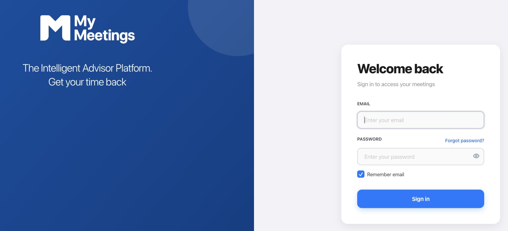

# MyMeetings

[Open MyMeetings · sign-in required](https://app.mymeetings.ai/)

## Useful notes after the meeting

MyMeetings combines live transcription, AI summaries and follow-up actions with client records. I built the recording and processing workflows and integrated transcription and language-model APIs.

## My work

- Live meeting transcription and structured summaries.
- Prompts and output schemas that distinguish discussion from decisions and capture follow-up actions from transcript evidence.
- Recovery for interrupted transcripts, including reconnect controls, a final-event drain and duplicate suppression before saving.

## An engineering decision

Stopping a recording and finishing its background processing are different events. I separated those lifecycles and added a short drain for final transcript segments, so shutdown does not immediately discard late events.

**Built with:** Expo, React Native, Expo Router, TypeScript, Supabase, WebSockets and transcription/LLM APIs.

## Website preview

Open MyMeetings · sign-in required

[Back to projects](README.md)
